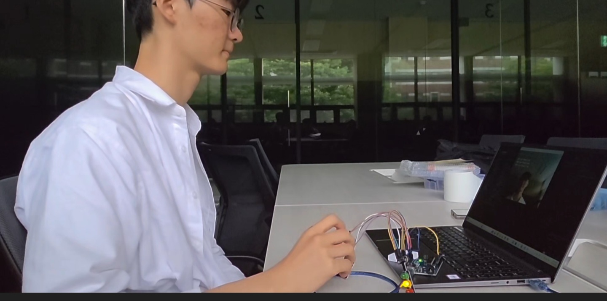
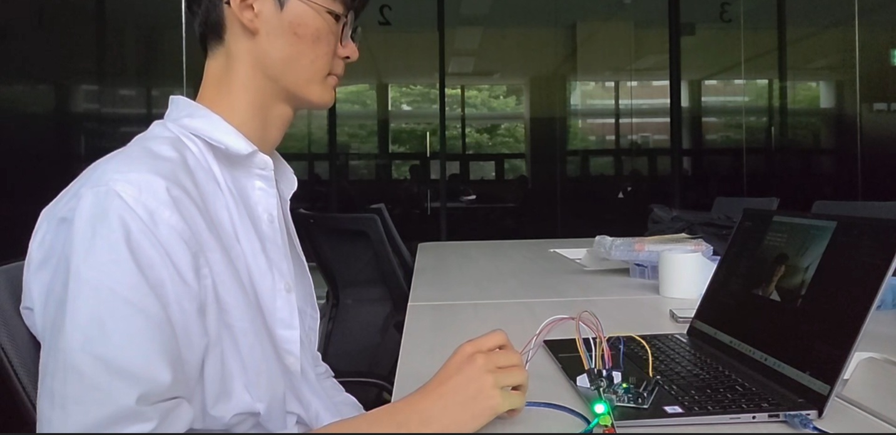
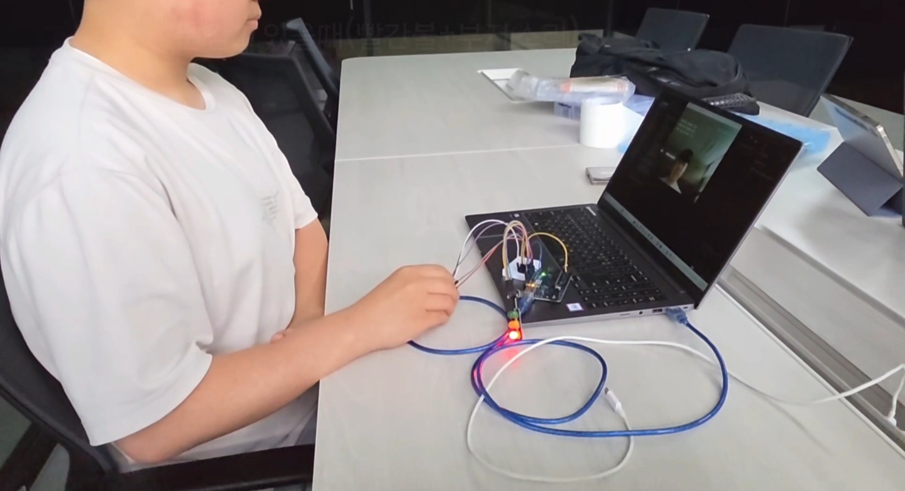
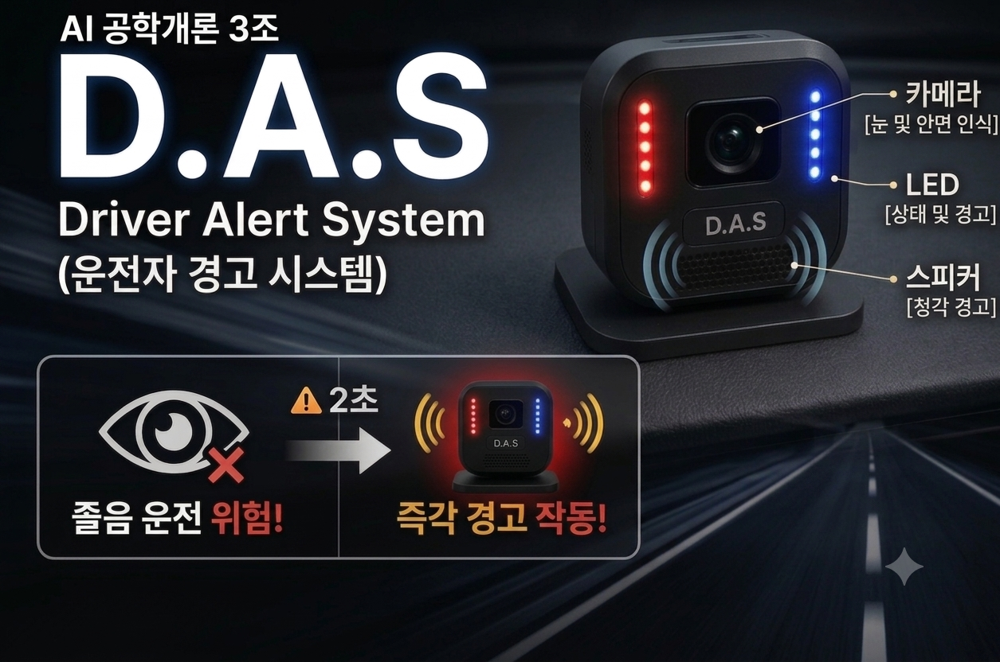

# D. A. S (운전자 경고 시스템) 

> *카메라로 운전자의 눈의 감김을 인식하고, 아두이노가 LED와 부저를 제어하여 운전자가 졸음운전을 하지 않게하는 시스템*

---

## 목차
1. [프로젝트 소개](#-프로젝트-소개)
2. [팀원 소개](#-팀원-소개)
3. [시스템 구조](#-시스템-구조)
4. [프로그램 설명](#-프로그램-설명)
5. [사용 기술 및 부품](#-사용-기술-및-부품)
6. [구현 방법](#-구현-방법)
7. [결과](#-결과)
8. [시연 영상](#-시연-영상)
9. [한계점](#-한계점)
9. [향후 개선 사항](#-향후-개선-사항)
10. [참고 자료](#-참고-자료)
---

## 프로젝트 소개
> 현대 사회에서 졸음운전이 운전자 본인도 자각치 못해 발생하며 그로 인해 대형 교통사고로 이어질 수 있는 위험이 큰 문제이다.  
> 따라서, 큰 사고로 이어질 수 있는 졸음운전을 운전자의 눈감는 시간을 AI가 자동적으로 파악하여, 스피커의 청각적 경고와 LED의 시각적 경고를 활용해서 졸음운전을 예방하고자 제작하게  
> 되었다. 

---

## 팀원 소개
| 이름 | 학과 | 학년 |
|------|------|--------|
| 박재현 | 바이오메디컬공학부 | 1학년 |
| 박예성 | 바이오메디컬공학부 | 2학년 |
| 강수연 | 바이오메디컬공학부 | 2학년 |
| 서채린 | 바이오메디컬공학부 | 1학년 |
| 박태헌 | 바이오메디컬공학부 | 1학년 |

---

## 시스템 구조

```
[카메라]
   │
   ▼
 [PC]          ┌─────────────────────────────────────────────────────────────────────┐
  │            ▼                                                                     │
  ├─  AI 모델 (MediaPipe)   ┌─────── ▶ AI 모델 (MediaPipe)                          │
  │    └─ 준비 화면         │           │  └─ 실행 화면                              │
  │                         │           │                                            │
  │                         │           │                                            │
  │                         │           │                                            │
  │                         │           └─ 시리얼 통신 (USB)                         │
  │                         │                   ├─────────────────────┐              │
  └─ 시리얼 통신 (USB)      │                   │                     │              │
         │                  │                   │                     │              │
         ▼                  │                   ▼                     ▼              │
    [Arduino]               │               [Arduino]             [Arduino]          │
      ├─ LED (노랑)         │                   ├─ LED (초록)         ├─ LED (빨강)   │
      └─ 버튼 ──────────────┘                   └─ 버튼               ├─ 부저         │
                                                    │                └─ 버튼          │
                                                    │                    │            │
                                                    └────────────────────┴────────────┘
```
## 프로그램 설명
> - 프로그램을 실행하면 준비 화면과 함께 LED에 노란불이 들어온다.  
> - 그 상태에서 버튼을 누르면 LED에서는 노란불이 꺼지고, AI가 눈의 크기를 측정하여 눈의 감긴 정도를 파악하고 프로그램에서는 실행 화면이 나온다.  
> - 눈이 떠있는 Alert 상태에서는 LED에 초록불이 들어온다.  
> - 눈이 감긴 상태로 2초 이상 경과시 초록불이 꺼지고, 부저가 울리고 LED에 빨간불이 들어온다.
> - 다시 눈을 뜨면 부저와 빨간색 LED 등이 꺼지고 LED에 초록불이 들어온다.
> - 프로그램이 실행 화면 상태일 때, 버튼을 다시 누르면 준비 화면으로 돌아가고 LED에는 노란불이 들어온다.

---

## 사용 기술 및 부품

### 소프트웨어
| 항목 | 내용 |
|------|------|
| AI 모델 | mediapipe 0.10.14 / OpenCV|
| 언어 | Python 3.11 (MediaPipe) / C (Arduino) |
| 아두이노 IDE | v2.3.9 |

### 하드웨어
| 부품 | 수량 | 용도 |
|------|------|------|
| Arduino Uno  | 1 | 메인 컨트롤러 |
| 웹캠 | 1 | 영상 입력 |
| 능동 부저 | 1 | 경보음 |
| 택트 스위치 | 1 | 눈 크기 설정 및 초기화 |
| 신호등 LED (Red/Yellow/Green) | 1 | 상태 표시 |
| 브레드보드, 점퍼선 | - | 회로 구성 |

---

## 구현 방법

### 1. AI 모델 (MediaPipe)

- **모델 선택 이유**: 모델에 눈 주위에 눈의 모양을 나타내는 점(랜드마크)이 있다. 이 점으로 감긴 눈의 크기를 측정하기가 쉽고 눈 크기 계산이 빠르다.  
&ensp;&ensp;&ensp;&ensp;&ensp;&ensp;&ensp;&ensp;&ensp;&ensp;&ensp;&ensp;&ensp;&ensp;&nbsp;또한, 다수의 데이터 사전 학습 없이도 프로그램 실행이 가능하다.
- **초기 데이터 수집**: 준비 상태에서 택트 스위치 클릭으로 눈크기를 측정한다.

### 2. MobileNetV2와의 차이점

- **'눈 감음'을 판단하는 기준**:  
&ensp;&nbsp;- **MediaPipe**: 눈의 위아래 거리와 양옆 거리를 잰 수학적 비율(EAR)로 눈의 크기를 실시간으로 계산한다.  
&ensp;&nbsp;- **MobileNetV2**: 함수를 거쳐 나온 현재 상태의 최종 결과가 '눈 감음' 클래스에 속하는지로 눈 감음 여부를 파악한다.

- **데이터 수집 및 학습**:  
&ensp;&nbsp;- **MediaPipe**: 데이터 학습 없이 처음 눈을 감은 상태만 찍으면 된다.  
&ensp;&nbsp;- **MobileNetV2**: 데이터 학습을 통해 눈 감음 여부를 학습한다.

### 3. 아두이노 제어 로직

- 준비 화면 상태에서 LED 노란불이 들어온다.
- 택트 스위치를 눌러 눈의 크기를 측정하고, LED 노란불이 꺼진다.
- 프로그램이 실행 화면으로 바뀌고, 눈이 떠진 상태일때 초록불이 뜬다.
- 프로그램에서 눈이 감긴 상태가 2초 이상 지속 시, 초록불이 꺼지고 빨간불이 들어오며 부저가 울린다.
- 이 상태에서 다시 눈을 뜨면, 부저가 꺼지고, LED는 빨간불에서 초록불로 바뀐다.
- 실행 상태에서 택트 스위치를 다시 누르면 프로그램이 준비 상태가 되고, LED 불이 초록색에서 노란불로 바뀐다.

---

## 결과

### 결과 이미지

| 인식 화면 | 아두이노 동작 |
|-----------|--------------|
|  |  |
|  |  |
|  |  |

---

## 시연 영상

[](https://drive.google.com/file/d/1BSkAZ7DtB2pdOjGpSqBkVfu_29alnI3p/view?usp=sharing)

> 클릭하면 영상으로 이동합니다.

---

## 한계점

- 눈의 랜드마크를 측정한 뒤, 눈을 감아도 눈이 감긴 것으로 측정되지 않는다.  
- 랜드마크로 측정하므로 눈을 감으면 랜드마크가 눈 위치에 정확하게 있지 않아 눈의 크기에 대한 계산이 정확하지 않다.
- 카메라의 환경(빛, 각도)에 따라 눈에 대한 인식이 달라 랜드마크가 정확히 나타나지 않는다.


## 향후 개선 사항

- 적외선 카메라와 적외선 LED를 도입하여 야간이나 어두운 환경에서도 안구 랜드마크를 정확히 추출할 수 있도록 한다. 
- 랜드마크를 정확히 측정하거나, 더 정확하게 랜드마크가 위치해 있는 모델을 사용해 프로그램을 만든다.
- 운전자의 눈 모양뿐만 아니라 고개 숙임 현상, 하품 빈도, 눈을 감는 빈도 수 등을 종합적으로 분석하여 운전자의 졸음 운전징후를 복합적으로  
  파악한다.

---

## 참고 자료
- 「Markdown(마크다운) 문법 & 사용법 : 줄바꿈(line break), 개행, 엔터」, 나아가는 중, https://dlee0129.tistory.com/47 (2026.06.09 검색)
- 「md 파일에 이미지 삽입 및 사이즈 조절하기」, 노경환, https://kyounghwan01.github.io/blog/etc/md-img-insert-resize/ (2026.06.09 검색)

---
